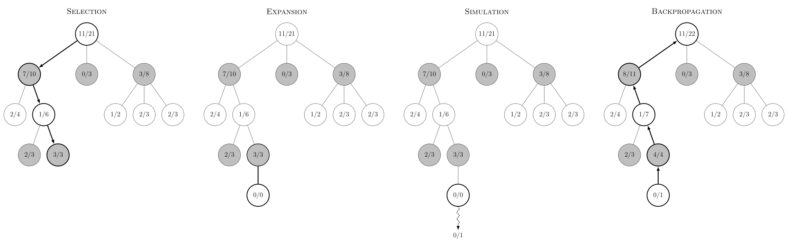

# Othello
Implementation of a Monte-Carlo Tree Search for Othello

To run this project, you can download only the executable "main" and run it on your terminal. If you have permission error try changing permissions with 


```python
sudo chmod 755 {path/to/main}
```


in the terminal and then open it (double click).

To play the game, you just need to enter the row then the column where you wish to play. Each turn the possible moves will be printed out.

If you want to make changes, compile the files with flags "-march=native" (we need -mbmi2 for pdep) and "-O3" for better performances.

Note that if you increase the allowed simulated time, you might get segmentation error due to the number of nodes being insufficient. You can either increase it or modify the functions to create nodes dynamically (but it will probably be slower). The default time is 100 ms, the computer should be reasonably strong. For the first turn, there are about 14k simulations on my laptop (which is not particularly powerful).

## Othello : The game
Othello, also known as Reversi, is a two players board game. It was invented in 1883.
The game is played on a 8 x 8 board, the aim is to capture more pieces than the other player. The starting position is the following :


Black (X) has the first move.

A player can capture adjacent opponent pieces in straight lines (horizontal, vertical, diagonal) if the pieces are adjacent and there is an empty cell at the end on the line.
For example, on the following position, black (X) is to move. The possible cells are marked by *.


It is possible that no legal moves are available; in this case, the player skips their turn.
The game ends when no players has any legal moves left, and the side with the most pieces wins.

A fun fact is that while the 4 x 4 and 6 x 6 variants were solved and are wins for the second player, the 8 x 8 is not.
From 1000000 random plays, black won 45.2%, white won 50.3% and 4.5% ended in a draw.
It is theorized that perfect play would result in a draw.


## Othello : Implementation
To implement the game, we use bitboards: instead of using a big and inconvenient 8 x 8 array to store the board state, we use two 64 bits integers, one for each player.
It is all the more convenient as it is exactly the number of cases !
For bigger boards, it would be possibe to use multiple integers to represent them, however with more edge cases to handle.

In bitboards, we map a bit to a case. In our case we use the following mapping.


Using bitboards has many advantages: they are very convenient for moves generation, wins conditions checking etc., thanks to bitwise operations.
Furthermore, those operations tend to be fast, and can often be optimised by the use of intrinsic functions. Finally, as they are very small, they are convenient for simulations, as making a copy is inexpensive.

### Moves generation
In order to generate the possible moves, we use shifting and masking operations. For example, if we want to "push" a cell to the E, we just need to do board << 1. But notice that by doing this, we do it also for all other possible cells, hence saving many operations.

Algorithmically, to find the possible moves, we need to do for each direction:
1. Find every pieces of the opponent adjacent to the player.
2. Continue in straight line while there are opponent pieces.
3. Check if there is an empty space at the end.

Here is the procedure for checking the E direction from the state above.  
Dots replace 0 for clarity; - are masked values.  
Step 1 :


These two bits are the ones adjacent to the player in the E direction.

Step 2 :
Repeat 6 times (because maximum length possible) the following operation :


In this case repeating will not add any more pieces.

Step 3 :


Finally, we obtained two possible moves on the E direction. To obtain all the moves, we repeat in each direction. Note that this process could be parallelized over each direction as they are independent.

### Applying a move
Applying a move is similar to the process before, excepted that we start from the target position.  
Algorithmically, this gives :
1. Update the board for the player
2. Repeat for each direction 
    1. Find the opponent pieces adjacent to this position
    2. Continue in straight line while there are opponent pieces
    3. Check if the border piece belongs to the player
        1. If true, the selected pieces needs to be flipped

### Win condition
In this game, the win condition is trivial; we just need to count the number of pieces for each player and compare them. Luckily, there is an intrinsic function that does it directly : popcount.

## Monte-Carlo Tree Search (MCTS)
### A short description

In such multiplayer games, a simple strategy is to simulate randomly a large number of games at a given step and to choose the move with the highest win rate. These strategies are often quite effective; Alpha-Go used MCTS for mid game to end games. The advantage is that they do not require any insights of the game contrary to alpha-beta or minimax which would often need heuristics.

Most of the time, MCTS means MCTS with Upper Confidence Bound (UCT). The twist here is that we would like to choose moves more efficiently. Indeed, random moves do not seem efficient as we would like to play "good" moves as we expect that the opponent is trying to win. But we cannot choose moves during the simulations only by a greedy strategy, as we may converge into suboptimal moves. Hence, we need a tradeoff between exploration and simulation which the UCB1 formula help up to do. We will introduce it a bit later since it needs some terminology.

The tree is MCTS consist of different nodes keeping track of the number of wins, the number of visits, and the possible children. In this implementation, all the nodes are created in the beginning as creating and deleting objects is relatively expensive and we move forwards as needed.

It would be impossible to add every visited state to our tree, as the size would grow exponentially. Instead, we add at most one node per iteration (called "rollout" or "playout" in MCTS terminology).

In each rollout, there are 4 phases :
1. Selection : As long as the current state is fully explored, choose a move with UCT. Else, if it is partially explored, choose randomly. In our case, we directly choose the "next" child that has not been explored yet.
2. Expansion : When we arrive to the first node that has not been explored, add it to the tree.
3. Simulation : Play the game till a terminal state or until a maximum number of turns. A heuristic function to evaluate a position will be needed in the case of early stopping.
4. Backpropagation : Traverse all the visited nodes during the rollout and increment the values as needed. In the vanilla implementation, a win yields 1, a draw 0.5 and a loss 0.



Note that Othello is a zero-sum game, in the sense that the advantage of a player is a disadvantage for the opponent. Hence, the need to only store wins and total number of games for a single player. In more sophisticated games, we may need to store different information for the players or to use different trees for each player.

Finally, the move can be chosen either by picking the child with the highest number of visits or with the highest win rate (but both should be the same).

To be clear, MCTS is not specific to multiplayer games; in fact it can be used in problems such as the multi-armed bandit.

### Upper Confidence Bound (UCB1)

As stated before, the main difficulty of MCTS is to balance exploitation vs exploration. For those who are a bit familiar with Reinforcement Learning, this will sound very familiar. In fact, MCTS could be considered as a very bare-bones RL algorithm, with different rewards given at the end of a rollout. 

This tradeoff is achieved by using the UCB1 formula :
\begin{equation*}
\frac{w_i}{n_i} + c \sqrt{\frac{\log N_i}{n_i}},
\end{equation*}
where $w_i$ represents the number of wins, $n_i$ the number of visits, $N_i$ the number of visit of the parent and $c$ and exploration parameter. Theoretically $c = \sqrt{2}$, but in practice, it is tuned for each specific game. For fully visited nodes, we choose the move maximizing this expression.

This formula is supposed to minimise the regret (difference between current rewards and what could have been obtained by using the best knows strategy) and was derived for the multi-armed bandit first.

Intuitively, the first term represents the exploitation with the expected reward and the second is exploration.

### MCTS variants
Many variants of MCTS exist. One perhaps easy to implement is the MCTS-solver. In this version, we keep track additionally of whether the node is solved. Indeed, if one of the child is a winning move then the current state is won, conversely if all children are losses, then the current position is lost. This is useful to cut the simulations short, especially during endgame and to better avoid traps.

## Additional links

https://www.hanshq.net/othello.html : A very interesting website that also tackle how to write a working application for different platforms.

http://radagast.se/othello/howto.html : Some insights about heuristic functions.


